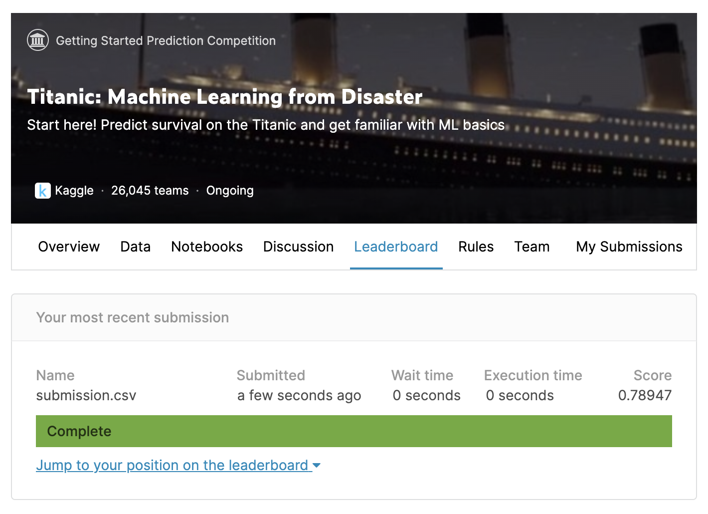

# kaggle-titanic

Kaggle의 대표적인 문제 중 하나인 Titanic 예측 모델. `titanic.ipynb` 파일을 확인하자.

(참고 : <https://www.kaggle.com/c/titanic/data>)


> 시작하기에 앞서.. 개발 환경 및 필요한 라이브러리

1. 개발 환경 : Python 3.6 & 아나콘다 설치 필요
2. 라이브러리 설치

```
pip install ipython
pip install sklearn
```


## Context, 목차

### 1. Defining the problem statement

문제에 대해서 이해하기

### 2. Collecting the data

데이터를 받아온다. 해당 데이터는 Kaggle 사이트에 있다. 링크는 위에 참고

### 3. Exploratory data analysis


데이터들이 어떤 값을 가지고 있고 어떤 관계가 있는지 짐작


### 4. Feature engineering

데이터의 값들을 수치화해서 정제된 데이터로 만드는 방법.

### 5. Modelling

모델링에는 5가지 방법을 이용한다.

#### 1. KNN

가장 이웃한 값들 중 label이 가장 많이 있는 것을 선택하는 방법.

#### 2. Decision Tree

의사결정나무. 가지치기 하면서 얻은 값들로 최적의 label 선택함.

#### 3. Random Forest

Decision Tree와 비슷하나 작은 트리들 여러개의 결과값 중에 가장 빈도수가 많은 것을 선택.

#### 4. Naive Bayes

확률로 구하는 문제. 

#### 5. SVM

초평면을 구하여 푸는 방법.


### 6. Testing

Modeling 한 Classifier 중에서 가장 Accuracy가 높은 모델 채택. 해당 데이터로 Test를 수행한 후 submit 한다.

`sumbission.csv` 파일로 저장하여 제출하면 끝!


## Kaggle 결과



78%의 정확도를 보였다.

> **References...**

